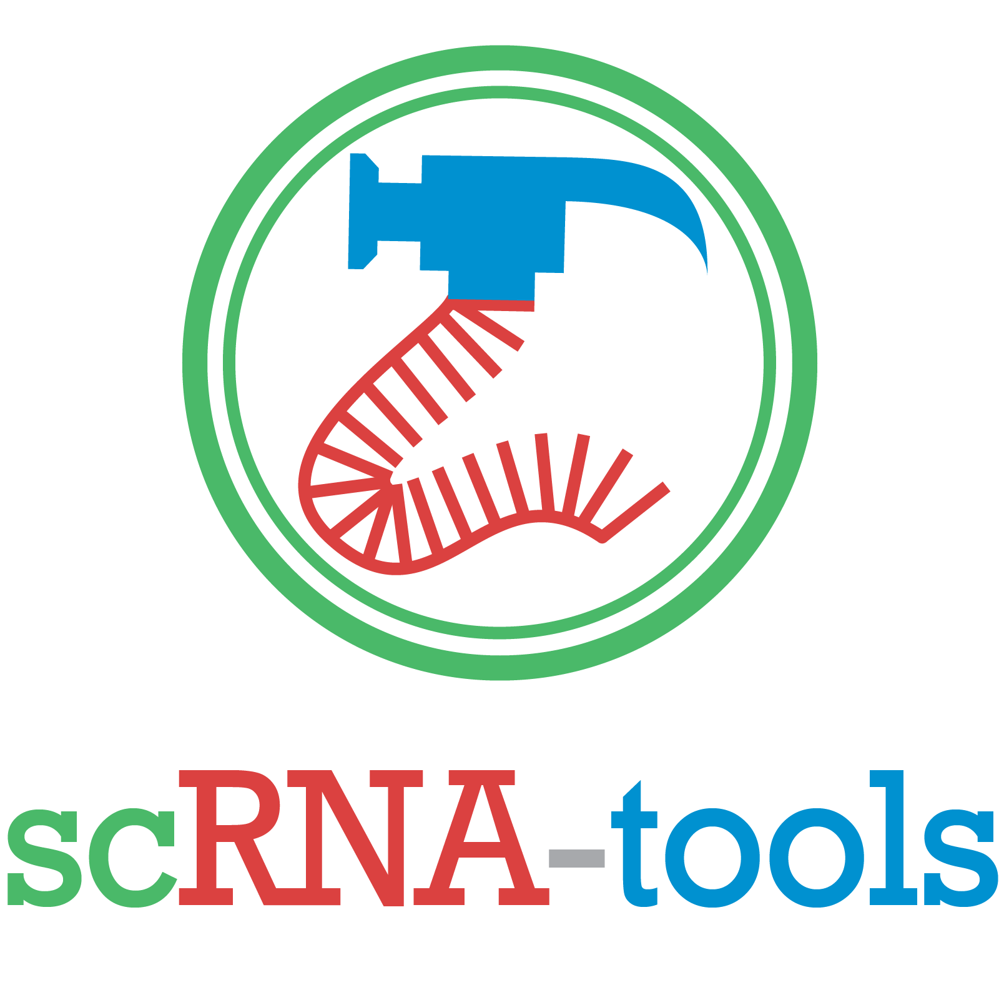

# scRNA-tools

A database of software tools for the analysis of single-cell RNA-seq data. To
make it into the database software must be available for download and public use
somewhere (CRAN, Bioconductor, PyPI, Conda, Github, Bitbucket, a private website
etc). To view the database head to https://www.scRNA-tools.org.

## Purpose

This database is designed to be an overview of the currently available scRNA-seq
analysis software, it is unlikely to be 100% complete or accurate but will be
updated as new software becomes available. If you notice a problem or would like
to add something please make a pull request or open an issue.

## Structure

The main tools table has the following columns:

* **Name**
* **Platform** - Programming language or platform where it can be used
* **DOI** - Publication DOI
* **PubDate** - Publication date. Preprints are marked with PREPRINT and will
  be updated when published.
* **Code** - URL for publicly available code.
* **Description**
* **License** - Software license
* ***FUNCTION COLUMNS*** (Described below)
* **Added** - Date when the entry added.
* **Updated** - Date when the entry was last updated.

### Function columns

The function columns are TRUE/FALSE columns indicating if the software has a
particular function. These are designed to be used as filters, for example when
looking for software to accomplish a particular task. They are also the most
likely to be inaccurate as software is frequently updated and it is hard to
judge all the functions a package has without making significant use of it. The
function columns ask the following questions of the software:

* **Assembly** - Can it perform assembly?
* **Alignment** - Does it align reads to a reference?
* **UMIs** - Does it handle Unique Molecular Identifiers?
* **Quantification** - Does it quantify expression from reads?
* **QualityControl** - Does it perform some type of quality control of cells?
* **Normalisation** - Does it perform some type of normalisation?
* **Imputation** - Can it impute missing dropout values?
* **Integration** - Does it combine scRNA-seq datasets or other single-cell data
  types?
* **GeneFiltering** - Does it perform some filtering of genes?
* **Clustering** - Does it perform clustering of cells?
* **Classification** - Does it classify cells based on a reference dataset?
* **Ordering** - Does it order cells along a (pseudotime) trajectory?
* **DifferentialExpression** - Does it do some kind of differential expression?
* **MarkerGenes** - Does it identify or mark use of cell type markers?
* **ExpressionPatterns** - Can it find genes with interesting patterns over
  (psuedo) time?
* **VariableGenes** - Does it identify highly variable genes?
* **GeneSets** - Does it test or make use of annotated gene sets?
* **GeneNetworks** - Does it find co-regulated gene networks?
* **CellCycle** - Does it identify or correct for the cell cycle or cell cycle
  (or similar) genes?
* **DimensionalityReduction** - Can it perform some type of dimensionality
  reduction?
* **Transformation** - Does it transform between expression values and some over
  measure?
* **Modality** - Does it identify or make use of modality in expression?
* **AlternativeSplicing** - Does it identify alternatice splicing?
* **RareCells** - Does it identify rare cells types?
* **StemCells** - Does it identify stem cells in a population?
* **Variants** - Does it detect or make use of variants?
* **Haplotypes** - Does it make use of haplotypes or perform phasing?
* **AlleleSpecific** - Does it detect allele specific expression?
* **Visualisation** - Does it do some kind of visualisation? (showing how to
  make a plot using `ggplot` or `matplotlib` doesn't count)
* **Interactive** - Does it have some kind of interactive component or a GUI?
* **Simulation** - Does it have functions for simulating scRNA-seq data?
